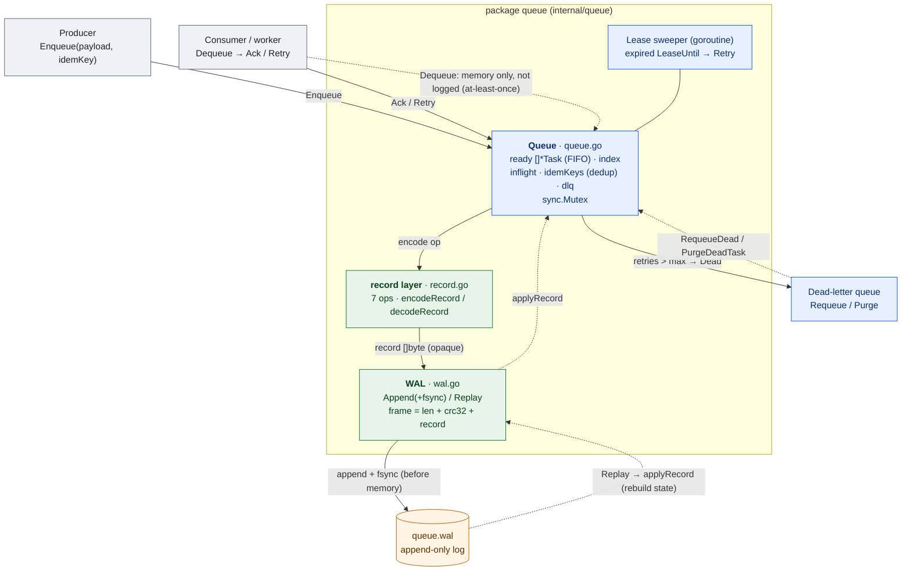
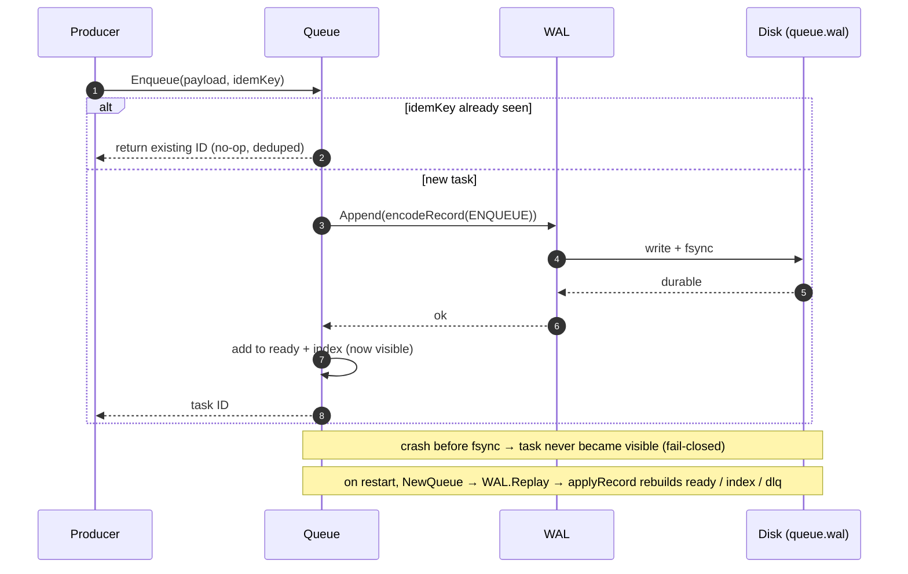

# Gojobs

> A durable, effectively-once task queue in Go — WAL-backed and in-process.

A producer/consumer job queue where every mutating operation is written to a
write-ahead log and `fsync`'d **before** it becomes visible in memory
(fail-closed), so a crash never leaves a half-applied task. On restart the queue
rebuilds itself by replaying the log. Delivery is at-least-once (a dequeued but
un-acked task comes back as ready) and made effectively-once via enqueue
deduplication plus idempotent consumers.

## Architecture



**Legend:** blue = in-memory state, green = durability layer, amber = disk,
gray = external caller. Solid edge = normal code path; dashed = a
deliberately-unlogged, recovery, or background path.

- **Write path** — `Enqueue` / `Ack` / `Retry` (and internally `Dead` /
  `Requeue` / `Purge`) encode a record and `Append` + `fsync` it to the log
  *before* touching memory. If the append fails, nothing becomes visible.
- **Recovery path** — `NewQueue` opens the log and `Replay`s it through
  `applyRecord`, rebuilding `ready` / `index` / `dlq`. Replay stops cleanly at a
  torn final record (a crash mid-append), keeping the good prefix.
- **Leasing & dead-letter** — `Dequeue` leases a task for a visibility timeout;
  the background sweeper retries any task whose lease expired. Retries use
  exponential backoff with jitter, and a task past its retry limit moves to the
  dead-letter queue, where it can be requeued or purged.

## Task lifecycle



## Run it

```sh
go run ./cmd/taskq
```

Enqueues a few tasks, drains them (dequeue → process → ack), and writes the log
to `data/queue.wal`. The library itself lives in `internal/queue`.

## Load testing

`cmd/loadtest` drives the queue under concurrent, failure-injecting load, verifies
the effectively-once guarantee, and reports throughput and latency. Each run appends
one git-tagged JSON record to `bench/results.jsonl`, so numbers stay comparable across
code changes.

```sh
go run ./cmd/loadtest -dur 30s -producers 8 -consumers 8 -failrate 0.2 -crashshare 0.5 -label baseline
```

Run it with **no flags** (`go run ./cmd/loadtest`) in a terminal and it walks you through
the knobs interactively, Enter accepting each default. Passing any flag skips the wizard;
piped/non-interactive stdin falls back to defaults.

- **Workload** — `-producers` goroutines enqueue unique-keyed tasks while `-consumers`
  goroutines dequeue them, for `-dur`. `-failrate` is the chance a delivery does *not*
  cleanly ack; `-crashshare` splits those failures into two real-world modes:
  - *pre-effect* — the handler fails before doing work: explicit `Retry` (backoff, then
    the DLQ once retries run out), no effect applied.
  - *post-effect* — the work happened but the ack is lost (a "crash"): the lease expires,
    the sweeper redelivers, and the idempotent consumer dedupes the repeat. This is the
    case the idempotency key exists for.
- **Correctness** — after the load window, a single-threaded drain finishes every task
  (acking what's ready and replaying the whole DLQ) until `acked == produced`, then
  asserts three invariants: every task's effect applied *exactly once*, every task
  completed, DLQ empty. A failure exits non-zero with the shortfall. Disabling DLQ
  replay makes it fail — which is how you know replay is load-bearing, not decorative.
- **Metrics** — throughput (ops/sec) and p50/p95/p99 latency, measured separately for
  enqueue, dequeue, and ack over the load window.

### Example baseline (macOS, 30s, 8 producers / 8 consumers, failrate 0.2)

| op | ops/sec | p50 | p99 |
|----|--------:|----:|----:|
| enqueue | ~231 | ~35 ms | ~61 ms |
| ack     | ~97  | ~36 ms | ~61 ms |
| dequeue | ~122 | ~33 ms | ~58 ms |

Numbers are machine-specific.

### Comparing runs

Because every run is tagged with its commit, before/after is a one-liner:

```sh
jq -s 'map({label, sha: .git.sha, enq: .ops.enqueue.ops_per_sec, ack_p99_ms: (.ops.ack.p99_us/1000)})' bench/results.jsonl
```
